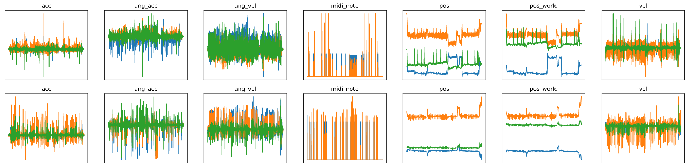

# Mixed Reality drumkit for machine learning research

Drums simulated in virtual reality

Virtual drums are overlayed onto an e-drum kit. MIDI and input streams from OVRInput are combined and sorted for input into a neural network.

Example of data captured from a performance
